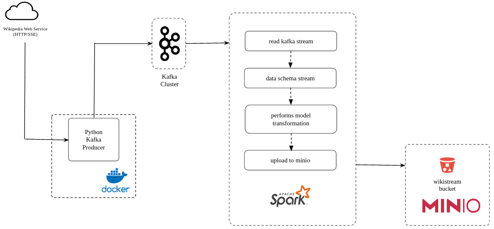

# **wikiStream**

the main objective of the project is to implement a data pipeline to store streaming 
data for later analysis, integrating spark structured streaming, kafka and minio - an 
open source project for data storage. 

---
## *Data flow*

the data flow consist of a python application will consume streaming events
from the [wikipedia stream](https://stream.wikimedia.org/?doc#/streams/get_v2_stream_recentchange) service and persist it into a kafka topic inside a Docker images. 
Next, a (py)Spark Streaming application will execute the following tasks `read_kafka_stream`,  
`data_schema_stream`, `performs_model_transformation` for example column renaming and type 
conversion and finally `upload_to_minio` which saves data in parquet format partitioning 
by change date and server name.



---
## *Running the project*
> **Note:** This project was developed in a linux environment specifically with:
> - Ubuntu 22.04 LTS
> - Docker Engine version 20.10.22
> - Docker Compose Version v2.14.1

Locate in the directory where the `docker-compose.yaml` file is located, then open the terminal
and type the following commands.

```bash
# build the Docker images
$ docker compose build

# starts services
$ docker compose up -d

# Execute (Py)Spark app
$ docker exec spark-master spark-submit sparkApps/src/kafka_spark_consumer.py 
```

Wait a few of minutes until all the services are finally running, then go to your browser:
- `localhost:8080` -> spark master
- `localhost:8081` -> spark worker
- `localhost:9001` -> minio (GUI). Here will can see the result - the data partitioning by change date 
and server name 
